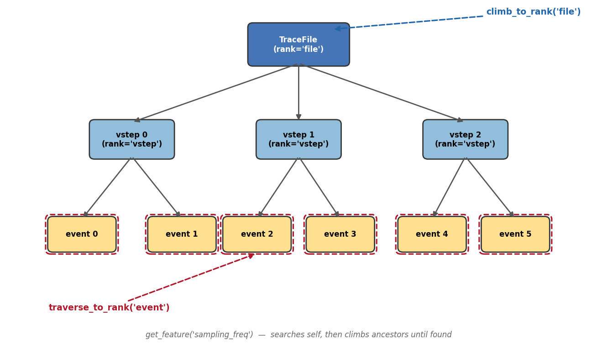
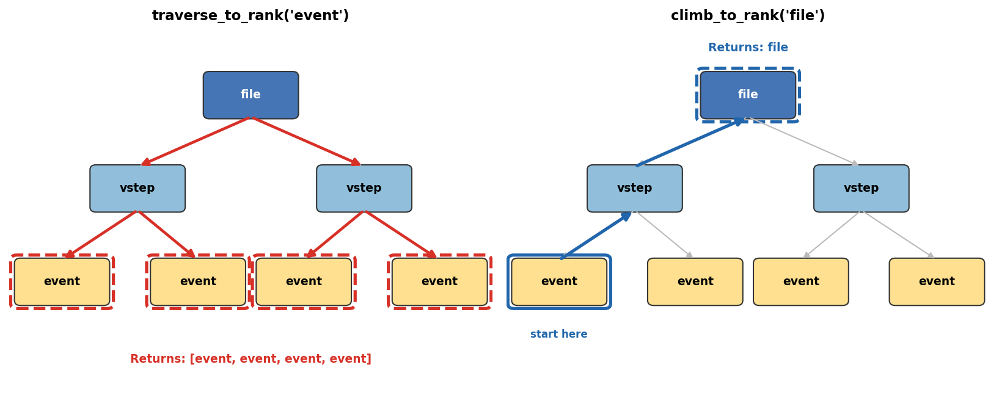

.. _concepts:

Core Concepts
=============

ionique represents nanopore data as a **segment tree** — a hierarchy of
nested segments where each level has a named *rank*. Understanding this model
is key to using the library effectively.

Segments and ranks
------------------

A **segment** is a contiguous slice of an ionic current trace, defined by
``start`` and ``end`` sample indices. Every segment has a **rank** — a string
label that describes its level in the hierarchy.

Common ranks:

- ``"file"`` — the full recording (a ``TraceFile``).
- ``"vstep"`` — a voltage step within the file.
- ``"vstepgap"`` — a trimmed voltage step (edge artifacts removed).
- ``"event"`` — a detected translocation event.

You can use any string as a rank. Parsers create children at a ``newrank``
you specify.

Segment vs MetaSegment
----------------------

ionique provides two segment types optimized for different use cases:

.. list-table::
   :header-rows: 1
   :widths: 20 40 40

   * - Class
     - Stores
     - Use when
   * - ``Segment``
     - Full current array (``numpy.ndarray``)
     - You need direct access to raw signal values
   * - ``MetaSegment``
     - Only ``start``, ``end``, ``rank``, and metadata
     - You want memory-efficient storage (thousands of events)

``MetaSegment`` computes statistics on the fly by slicing its ancestor's
current array:

.. code-block:: python

   from ionique.core import Segment, MetaSegment
   import numpy as np

   # Segment holds its own data
   seg = Segment(current=np.random.randn(1000), start=0, end=1000, rank="event")
   print(seg.mean)  # computed from seg.current

   # MetaSegment holds only boundaries
   meta = MetaSegment(start=0, end=1000, rank="event", parent=some_file)
   print(meta.mean)  # computed from parent's current[0:1000]

Convert a ``Segment`` to a ``MetaSegment`` to free memory:

.. code-block:: python

   seg.to_meta()
   # seg is now a MetaSegment — the current array is released

.. note::
   ``MetaSegment.current`` requires a valid parent chain up to a file-level
   segment. It returns ``None`` if the chain is broken.

Tree traversal
--------------

**Going down** — ``traverse_to_rank(rank)`` recursively collects all
descendants at the given rank:

.. code-block:: python

   # Get every event across all voltage steps
   events = trace.traverse_to_rank("event")
   print(f"{len(events)} events found")

**Going up** — ``climb_to_rank(rank)`` walks up the parent chain:

.. code-block:: python

   # From an event, find its parent voltage step
   vstep = event.climb_to_rank("vstep")
   print(f"Event belongs to vstep at samples {vstep.start}–{vstep.end}")

   # Or go all the way to the file
   file_seg = event.climb_to_rank("file")

**Other traversal helpers:**

.. code-block:: python

   # Get the root of the tree
   root = event.get_top_parent()

   # Summary of all ranks and their counts
   trace.summary()
   # {'file': 1, 'vstep': 5, 'event': 42}

Feature lookup
--------------

``get_feature(name)`` searches the segment's ``unique_features`` dictionary,
then climbs to ancestors until found:

.. code-block:: python

   # sampling_freq is stored at the file level
   trace.unique_features["sampling_freq"] = 100000

   # Any descendant can access it
   event = trace.traverse_to_rank("event")[0]
   fs = event.get_feature("sampling_freq")  # returns 100000

This pattern avoids duplicating metadata across thousands of event segments.

You can also store per-segment features:

.. code-block:: python

   event.unique_features["blockade_depth"] = 0.45
   event.unique_features["dwell_time"] = 0.003

Parsing: creating children
--------------------------

The ``parse()`` method subdivides a segment using a parser object:

.. code-block:: python

   from ionique.parsers import SpeedyStatSplit

   parser = SpeedyStatSplit(sampling_freq=100000, min_width=50)

   # Parse at the vstep level, creating events
   trace.parse(parser, newrank="event", at_child_rank="vstep")

What happens:

1. ``parse()`` finds all children at rank ``"vstep"``.
2. For each vstep, the parser analyzes its current data.
3. Detected boundaries become new child segments at rank ``"event"``.

The ``at_child_rank`` parameter controls which level gets parsed. Without it,
the parser runs on the segment itself.

**Chaining parsers** — parse at successively deeper ranks:

.. code-block:: python

   # First pass: coarse segmentation
   trace.parse(coarse_parser, newrank="block", at_child_rank="vstep")

   # Second pass: fine segmentation within each block
   trace.parse(fine_parser, newrank="event", at_child_rank="block")

Building trees manually
-----------------------

You can construct segment trees without parsers:

.. code-block:: python

   from ionique.core import MetaSegment

   # Create a parent
   parent = MetaSegment(start=0, end=100000, rank="vstep")

   # Create children
   events = [
       MetaSegment(start=1000, end=1500, rank="event", parent=parent),
       MetaSegment(start=3000, end=3800, rank="event", parent=parent),
       MetaSegment(start=7000, end=7200, rank="event", parent=parent),
   ]
   parent.add_children(events)

   # Children are sorted by start position
   for ev in parent.children:
       print(f"  event at {ev.start}–{ev.end}")

To remove all children at a rank and re-parse:

.. code-block:: python

   parent.clear_children()
   parent.parse(new_parser, newrank="event")

Segment statistics
------------------

Both ``Segment`` and ``MetaSegment`` expose computed properties:

.. code-block:: python

   event = trace.traverse_to_rank("event")[0]

   event.mean      # np.mean(current)
   event.std       # np.std(current)
   event.min       # np.min(current)
   event.max       # np.max(current)
   event.n         # number of samples
   event.duration  # time span in seconds (requires sampling_freq)

These are computed on every access (not cached), so store results in variables
if you need them repeatedly.

Serialization
-------------

Segments can be serialized to JSON for storage or transfer:

.. code-block:: python

   # To JSON string
   json_str = event.to_json()

   # To file
   event.to_json("event_data.json")

   # Reconstruct
   from ionique.core import MetaSegment
   restored = MetaSegment.from_json("event_data.json")
