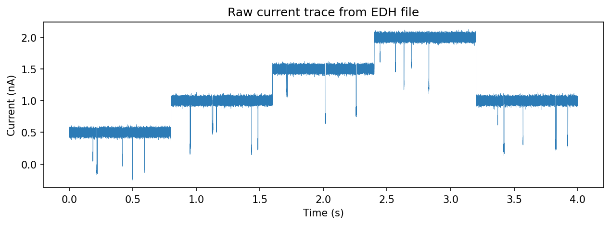
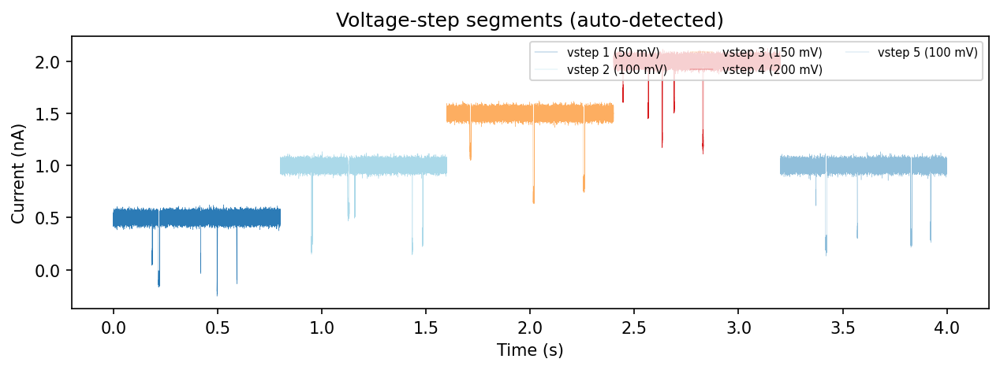
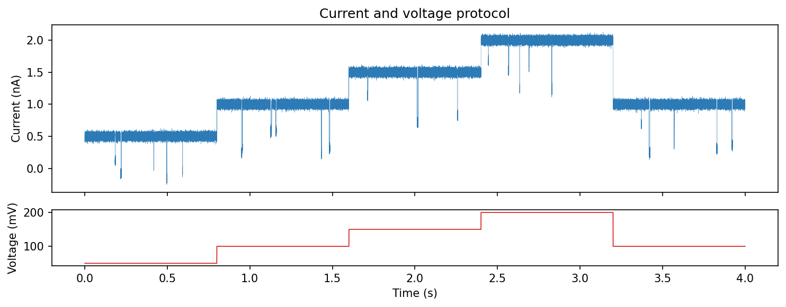

.. _data-input:

Data Input
==========

ionique reads nanopore recordings from several file formats, converts units,
and wraps the result in a :class:`~ionique.datatypes.TraceFile` for downstream
analysis.

Supported formats
-----------------

.. list-table::
   :header-rows: 1
   :widths: 15 20 65

   * - Extension
     - Reader class
     - Description
   * - ``.edh``
     - ``EDHReader``
     - Element Data Header files. Binary current/voltage with XML metadata.
   * - ``.opt``
     - ``OPTReader``
     - Orbit Potential files. Similar parameters to EDHReader.
   * - ``.abf``
     - ``ABFReader``
     - Axon Binary Format (pClamp). Requires the ``pyabf`` package.

All readers are subclasses of ``AbstractFileReader`` and return the same
three-element tuple: ``(metadata, current, voltage)``.

Loading an EDH file
-------------------

.. code-block:: python

   from ionique.io import EDHReader

   reader = EDHReader("experiment.edh")
   metadata, current, voltage = reader

``metadata`` is a dictionary with keys such as ``sampling_frequency``,
``current_scaling``, and ``voltage_scaling``. ``current`` and ``voltage`` are
NumPy arrays in SI units (amperes and volts).

Reader parameters
^^^^^^^^^^^^^^^^^

``EDHReader`` and ``OPTReader`` accept these keyword arguments:

.. list-table::
   :header-rows: 1
   :widths: 25 15 60

   * - Parameter
     - Default
     - Description
   * - ``voltage_compress``
     - ``False``
     - Split voltage into step boundaries (returns list of tuples instead of
       flat array).
   * - ``downsample``
     - ``1``
     - Integer downsampling factor. ``downsample=5`` keeps every 5th sample.
   * - ``n_remove``
     - ``0``
     - Samples to discard from the start of each voltage step.
   * - ``prefilter``
     - ``None``
     - A callable applied to the raw current before returning.

.. code-block:: python

   # Downsample 10x and split voltage steps
   reader = EDHReader(
       "experiment.edh",
       downsample=10,
       voltage_compress=True,
   )
   metadata, current, voltage = reader

   # voltage is now a list of ((start, end), voltage_value) tuples
   for (start, end), v in voltage:
       print(f"Samples {start}–{end}: {v*1000:.1f} mV")

Loading an OPT file
-------------------

``OPTReader`` has the same interface:

.. code-block:: python

   from ionique.io import OPTReader

   reader = OPTReader("recording.opt", voltage_compress=True, downsample=5)
   metadata, current, voltage = reader

Creating a TraceFile
--------------------

``TraceFile`` wraps the reader output into a segment-tree node at rank
``"file"``:

.. code-block:: python

   from ionique.datatypes import TraceFile

   trace = TraceFile(current, voltage=voltage, metadata=metadata)

When ``voltage`` contains step boundaries (from ``voltage_compress=True``),
``TraceFile`` automatically creates child segments at rank ``"vstep"``:

.. code-block:: python

   print(trace.summary())
   # {'file': 1, 'vstep': 5}

   for vstep in trace.children:
       print(f"vstep at {vstep.start}–{vstep.end}, voltage = {vstep.get_feature('voltage')}")

Voltage protocol
----------------

The voltage array encodes the applied voltage at each sample. With
``voltage_compress=True``, ionique detects transitions and splits the trace
into constant-voltage segments.

Under the hood, ``utils.split_voltage_steps()`` finds voltage transitions:

.. code-block:: python

   from ionique.utils import split_voltage_steps
   import numpy as np

   # Example voltage array from a raw file
   voltage_array = np.zeros(1000000)
   voltage_array[0:100000] = 0.1
   voltage_array[100000:200000] = 0.2
   voltage_array[200000:900000] = 0.25
   
   boundaries = split_voltage_steps(voltage_array, n_remove=0, as_tuples=True)
   # [(0, 100000), (100000, 200000), (200000, 900000), (900000, 1000000)]

SessionFileManager
------------------

``SessionFileManager`` is a singleton that acts as the root of the segment
tree. All ``TraceFile`` instances are automatically registered as its
children:

.. code-block:: python

   from ionique.datatypes import SessionFileManager

   session = SessionFileManager()
   # After loading files, they appear as children:
   for child in session.children:
       print(child.rank, child.unique_features.get("filename"))

It also maintains an ``affector_table`` that tracks which readers and
transforms have been applied during the session.
