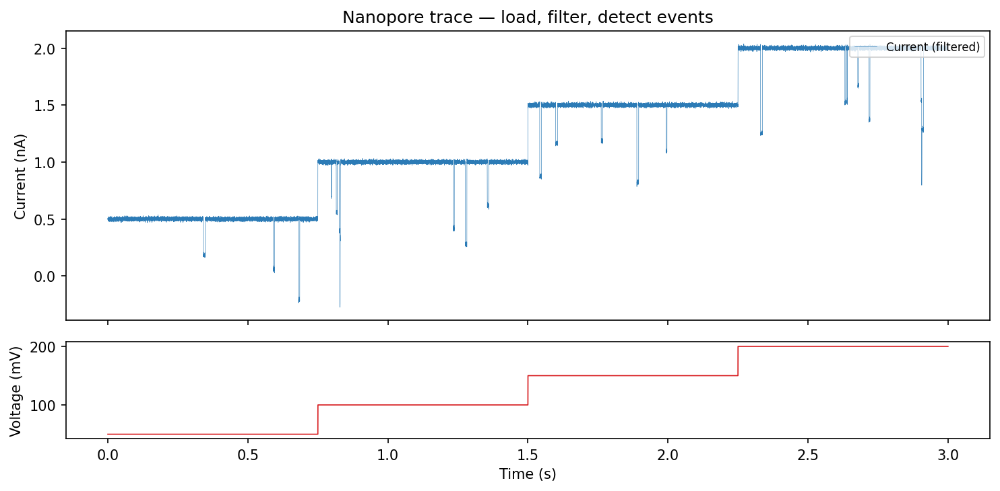
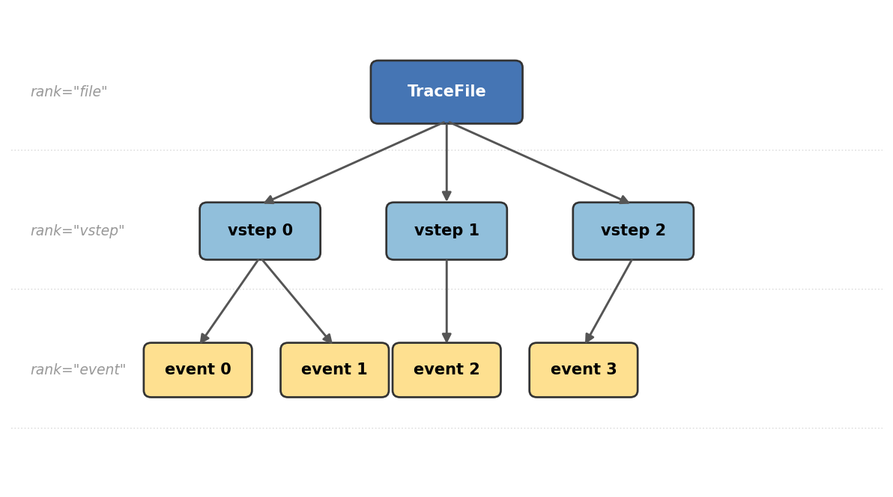

.. _getting-started:

Getting Started
===============

This page walks through a complete ionique workflow in under five minutes:
load a nanopore recording, filter noise, detect events, and extract features.

Minimal workflow
----------------

.. code-block:: python

   from ionique.io import EDHReader
   from ionique.datatypes import TraceFile
   from ionique.parsers import AutoSquareParser, SpeedyStatSplit
   from ionique.utils import Filter, Trimmer, extract_features

   # 1. Load an EDH file with voltage-step splitting
   metadata, current, voltage = EDHReader("experiment.edh", voltage_compress=True)
   trace = TraceFile(current, voltage=voltage, metadata=metadata)

   # 2. Filter high-frequency noise
   filt = Filter(
       cutoff_frequency=5000,
       filter_type="lowpass",
       sampling_frequency=trace.sampling_freq,
   )
   filt(trace.current)

   # 3. Trim transient artifacts at voltage-step edges
   trimmer = Trimmer(samples_to_remove=200)
   trimmer(trace)

   # 4. Detect blockade events
   detector = AutoSquareParser(threshold_baseline=0.7, expected_conductance=1.9)
   trace.parse(detector, newrank="event", at_child_rank="vstepgap")

   # 5. (Optional) Segment sub-states within each event
   splitter = SpeedyStatSplit(sampling_freq=trace.sampling_freq, min_width=50)
   trace.parse(splitter, newrank="state", at_child_rank="event")

   # 6. Extract features to a pandas DataFrame
   df = extract_features(trace, "event", ["mean", "std", "duration"])
   print(df.head())

Every step adds structure to a **segment tree** — a hierarchy where each node
represents a contiguous slice of the current trace.

The segment tree
----------------

ionique organizes data as a tree of segments. Parsing subdivides parent
segments into children at a new *rank*:

- **TraceFile** (rank ``"file"``) — the full recording with current, voltage,
  and metadata.
- **Voltage steps** (rank ``"vstep"``) — created automatically when you load
  with ``voltage_compress=True``. Each step corresponds to a constant applied
  voltage.
- **Events** (rank ``"event"``) — detected by an event detector
  (AutoSquareParser, SpikeParser, or lambda_event_parser) within each voltage
  step (or trimmed step, ``"vstepgap"``).
- **States** (rank ``"state"``, optional) — sub-states within an event,
  resolved by SpeedyStatSplit when events have multi-level current structure.

You can traverse down with ``traverse_to_rank()`` and up with
``climb_to_rank()``. Features like ``sampling_freq`` are looked up by climbing
the tree until found.

What's next
-----------

- :doc:`data_input` — loading different file formats and understanding
  TraceFile.
- :doc:`concepts` — the segment tree model in depth.
- :doc:`signal_preprocess` — filtering and trimming options.
- :doc:`parsers_guide` — choosing and configuring a parser.
- :doc:`signal_analysis` — extracting features and building IV curves.
- :doc:`visualization` — plotting traces and events with ``qp_trace()``.
- :doc:`tutorial` — end-to-end walkthrough with synthetic data.
