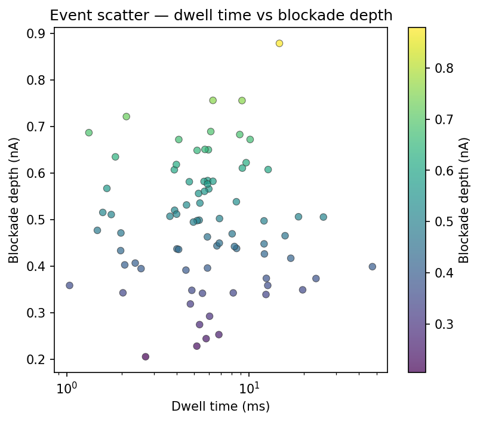
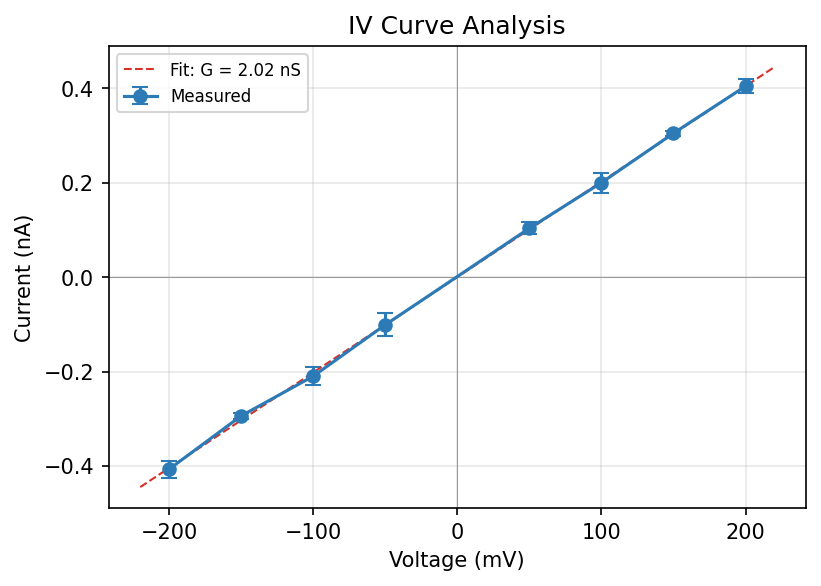

.. _signal-analysis:

Signal Analysis
===============

After detecting events, the next step is extracting quantitative features.
ionique provides ``extract_features()`` to collect segment statistics into a
pandas DataFrame, plus tools for IV curve analysis.

Segment statistics
------------------

Every segment (``Segment`` or ``MetaSegment``) exposes these computed
properties:

.. code-block:: python

   event = trace.traverse_to_rank("event")[0]

   event.mean      # mean current (nA)
   event.std       # standard deviation
   event.min       # minimum current value
   event.max       # maximum current value
   event.n         # number of samples
   event.duration  # time in seconds (requires sampling_freq in tree)

These are computed from the underlying current array on each access.

Extracting features with ``extract_features``
----------------------------------------------

``extract_features()`` walks the segment tree, collects statistics from every
segment at a target rank, and returns a DataFrame:

.. code-block:: python

   from ionique.utils import extract_features

   df = extract_features(
       trace,
       bottom_rank="event",
       extractions=["mean", "std", "min", "max", "duration", "n"],
   )
   print(df.head())
   #       mean      std      min      max  duration     n
   # 0    1.123    0.031    1.045    1.210     0.005   500
   # 1    0.876    0.028    0.812    0.945     0.003   300
   # ...

**Parameters:**

.. list-table::
   :header-rows: 1
   :widths: 20 15 65

   * - Parameter
     - Default
     - Description
   * - ``seg``
     - (required)
     - Root segment to traverse.
   * - ``bottom_rank``
     - (required)
     - Rank of segments to extract features from.
   * - ``extractions``
     - (required)
     - List of attribute names to include as columns. Any property of the
       segment class works: ``"mean"``, ``"std"``, ``"min"``, ``"max"``,
       ``"duration"``, ``"n"``, ``"start"``, ``"end"``.
   * - ``add_ons``
     - ``{}``
     - Dictionary of constant values to add as columns (e.g. filename,
       condition labels).
   * - ``lambdas``
     - ``{}``
     - Dictionary of computed columns. Each value is a callable that takes
       a segment and returns a value.

Adding constant columns
^^^^^^^^^^^^^^^^^^^^^^^

Use ``add_ons`` to tag every row with metadata:

.. code-block:: python

   df = extract_features(
       trace,
       "event",
       ["mean", "std", "duration"],
       add_ons={
           "filename": "experiment_001.edh",
           "voltage_mV": 150,
           "condition": "control",
       },
   )
   # Every row has filename, voltage_mV, and condition columns

Custom computed columns
^^^^^^^^^^^^^^^^^^^^^^^

Use ``lambdas`` for per-segment calculations:

.. code-block:: python

   df = extract_features(
       trace,
       "event",
       ["mean", "duration"],
       lambdas={
           "blockade_depth": lambda seg: seg.climb_to_rank("vstep").mean - seg.mean,
           "parent_voltage": lambda seg: seg.get_feature("voltage"),
           "snr": lambda seg: abs(seg.mean) / seg.std if seg.std > 0 else 0,
       },
   )

Combining features from multiple files
^^^^^^^^^^^^^^^^^^^^^^^^^^^^^^^^^^^^^^^

.. code-block:: python

   import pandas as pd

   all_dfs = []
   for filename in edh_files:
       reader = EDHReader(filename, voltage_compress=True)
       trace = TraceFile(*reader)
       # ... filter, trim, parse ...
       df = extract_features(
           trace, "event", ["mean", "std", "duration"],
           add_ons={"filename": filename},
       )
       all_dfs.append(df)

   combined = pd.concat(all_dfs, ignore_index=True)

Scatter plots
-------------

A scatter plot of dwell time versus blockade depth is the standard
visualization for nanopore translocation data:

.. code-block:: python

   import matplotlib.pyplot as plt

   fig, ax = plt.subplots()
   ax.scatter(df["duration"] * 1000, df["blockade_depth"], s=20, alpha=0.6)
   ax.set_xlabel("Dwell time (ms)")
   ax.set_ylabel("Blockade depth (nA)")
   ax.set_xscale("log")
   plt.show()

IV curve analysis
-----------------

For recordings with multiple voltage steps, you can build a current–voltage
curve:

**Step 1:** Extract mean current per voltage step:

.. code-block:: python

   vsteps = trace.traverse_to_rank("vstep")
   voltages = []
   currents = []
   for vs in vsteps:
       v = vs.get_feature("voltage")
       voltages.append(v * 1000)   # convert to mV
       currents.append(vs.mean)

**Step 2:** Fit and plot:

.. code-block:: python

   import numpy as np
   import matplotlib.pyplot as plt

   coeffs = np.polyfit(voltages, currents, 1)
   conductance_nS = coeffs[0] * 1000
   print(f"Conductance: {conductance_nS:.2f} nS")

   fig, ax = plt.subplots()
   ax.plot(voltages, currents, "o", label="Measured")
   fit_v = np.linspace(min(voltages), max(voltages), 100)
   ax.plot(fit_v, np.polyval(coeffs, fit_v), "--", label=f"G = {conductance_nS:.1f} nS")
   ax.set_xlabel("Voltage (mV)")
   ax.set_ylabel("Current (nA)")
   ax.legend()
   plt.show()

**Using IVCurveAnalyzer:**

.. code-block:: python

   from ionique.parsers import IVCurveAnalyzer

   analyzer = IVCurveAnalyzer(
       current=trace.current,
       parent_segment=trace,
       sampling_frequency=trace.sampling_freq,
       method="simple",
   )
   iv_data = analyzer.analyze()
   # {voltage: (mean_current, std_current), ...}
