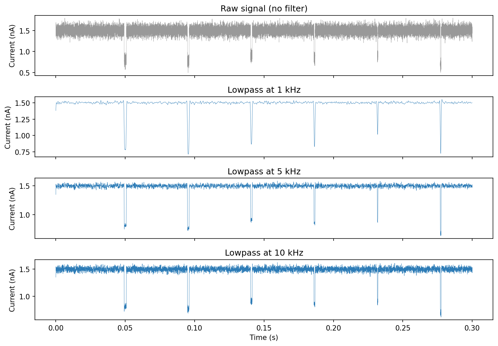
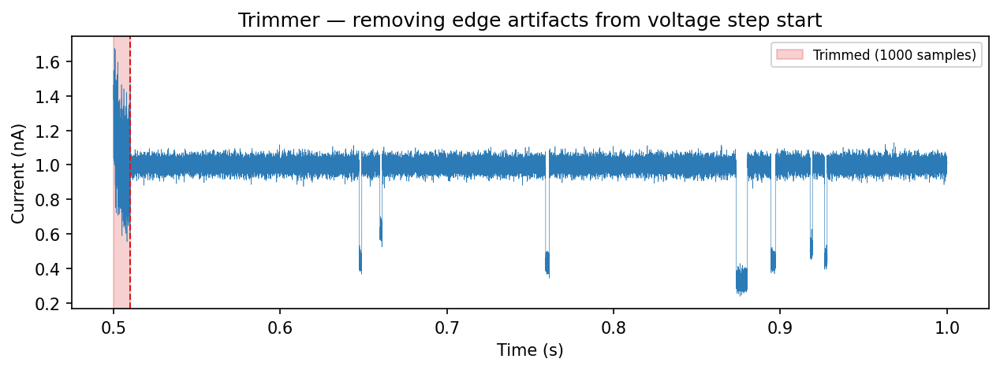

.. _signal-preprocess:

Signal Preprocessing
====================

Preprocessing reduces noise and removes artifacts before event detection.
ionique provides three tools: ``Filter`` for frequency-domain filtering,
``ClockFilter`` for removing instrument clock tones, and ``Trimmer`` for
discarding edge transients at voltage-step boundaries.

Filtering with ``Filter``
-------------------------

``Filter`` wraps scipy's Butterworth and Bessel IIR filters with a simple
callable interface. It modifies the current array **in place**.

.. code-block:: python

   from ionique.utils import Filter

   filt = Filter(
       cutoff_frequency=5000,       # Hz
       filter_type="lowpass",
       filter_method="butter",      # or "bessel"
       order=2,
       bidirectional=True,          # zero-phase (sosfiltfilt)
       sampling_frequency=100000,
   ) 
   # filt is now a callable that will modify a current array in place
   filt(trace.current)

**Filter types:**

- ``"lowpass"`` — removes high-frequency noise above the cutoff.
- ``"highpass"`` — removes low-frequency drift below the cutoff.
- ``"bandpass"`` — keeps frequencies between two cutoffs (pass a list:
  ``cutoff_frequency=[100, 5000]``).
- ``"bandstop"`` — removes a frequency band (e.g. 50/60 Hz line noise).

**Filter methods:**

- ``"butter"`` (default) — Butterworth, flat passband response.
- ``"bessel"`` — preserves waveform shape, better group delay.

**Filter order:**

Specifies the order of the filter, i.e. how aggressively frequencies are filtered beyond the cutoff range. 
A high order (e.g. ``order=16``) ``"bessel"`` filter approximates a gaussian blur.

**Unidirectional vs. Bidirectional filtering**
When ``bidirectional=True`` (default), the filter is applied forward and
backward (``scipy.signal.sosfiltfilt``), eliminating phase distortion.
Set ``bidirectional=False`` to use causal filtering (``sosfilt``). Note that bidirectional doubles the filter order.

Choosing a cutoff frequency
^^^^^^^^^^^^^^^^^^^^^^^^^^^

The cutoff controls how much noise you remove versus how much signal detail
you preserve. Lower cutoffs produce smoother traces but may blur fast events and details.

The figure shows the same noisy spike signal filtered at three cutoffs:

.. code-block:: python

   for cutoff in [1000, 5000, 10000]:
       filt = Filter(
           cutoff_frequency=cutoff,
           filter_type="lowpass",
           sampling_frequency=100000,
       )
       filtered = trace.current.copy()
       filt(filtered)

- **1 kHz** — very smooth, but fast transients are attenuated.
- **5 kHz** — good balance for most nanopore experiments.
- **10 kHz** — preserves fast events but retains more noise.

.. tip::
   A common starting point is ``cutoff_frequency = sampling_freq / 20``
   (e.g. 5 kHz for a 100 kHz recording).

Clock-tone removal with ``ClockFilter``
----------------------------------------

Some instruments inject a periodic clock signal into the current trace.
``ClockFilter`` estimates and subtracts this tone by fitting a sine wave at
the clock frequency within sliding windows.

.. code-block:: python

   from ionique.utils import ClockFilter

   clock = ClockFilter(
       clock_frequency=1000,       # Hz — the clock tone frequency
       section_length=0.5,         # seconds — window for sine fitting
       sampling_frequency=100000,
   )
   clock(trace.current)

``ClockFilter`` modifies the array in place, just like ``Filter``.

**Parameters:**

.. list-table::
   :header-rows: 1
   :widths: 25 15 60

   * - Parameter
     - Default
     - Description
   * - ``clock_frequency``
     - (required)
     - Frequency of the clock tone to remove (Hz).
   * - ``section_length``
     - ``0.5``
     - Length of each fitting window in seconds. Shorter windows track
       amplitude changes better; longer windows give more stable fits.
   * - ``sampling_frequency``
     - ``None``
     - Sampling rate. If ``None``, looked up from the segment tree.

Trimming with ``Trimmer``
-------------------------

Voltage-step boundaries often contain transient artifacts — capacitive
spikes, settling oscillations, or amplifier saturation. ``Trimmer`` removes a
fixed number of samples from the start of each segment at a specified rank.

.. code-block:: python

   from ionique.utils import Trimmer

   trimmer = Trimmer(
       samples_to_remove=500,  # discard first 500 samples of each vstep
       rank="vstep",           # operate at this rank
       newrank="vstepgap",     # children get this rank
   )
   trimmer(trace)

After trimming, each ``"vstep"`` segment gains a child at rank
``"vstepgap"`` that excludes the leading samples. Downstream parsers should
target ``"vstepgap"`` instead of ``"vstep"``:

.. code-block:: python

   # Parse events within trimmed steps
   trace.parse(parser, newrank="event", at_child_rank="vstepgap")

**Parameters:**

.. list-table::
   :header-rows: 1
   :widths: 25 15 60

   * - Parameter
     - Default
     - Description
   * - ``samples_to_remove``
     - (required)
     - Number of samples to discard from the start of each segment.
   * - ``rank``
     - ``"vstep"``
     - Rank of segments to trim.
   * - ``newrank``
     - ``"vstepgap"``
     - Rank assigned to the trimmed child segments.

Chaining preprocessors
----------------------

Preprocessors are composable. A typical pipeline:

.. code-block:: python

   from ionique.utils import Filter, ClockFilter, Trimmer

   # 1. Remove clock tone
   ClockFilter(clock_frequency=1000, sampling_frequency=100000)(trace.current)

   # 2. Lowpass filter
   Filter(cutoff_frequency=5000, filter_type="lowpass",
          sampling_frequency=100000)(trace.current)

   # 3. Trim voltage-step edges
   Trimmer(samples_to_remove=300)(trace)

Order matters: remove narrowband interference (clock) before broadband
filtering, and trim *after* filtering so the filter has context samples at
segment boundaries.
