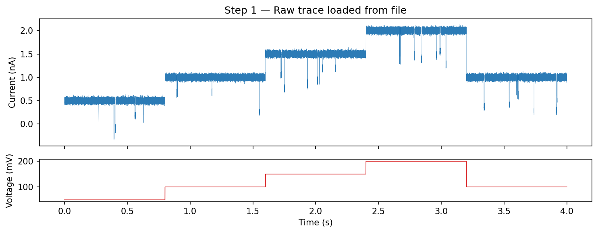
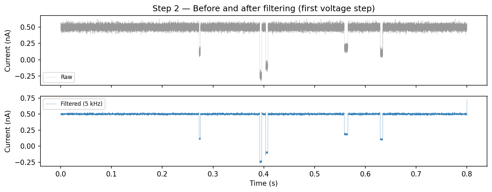
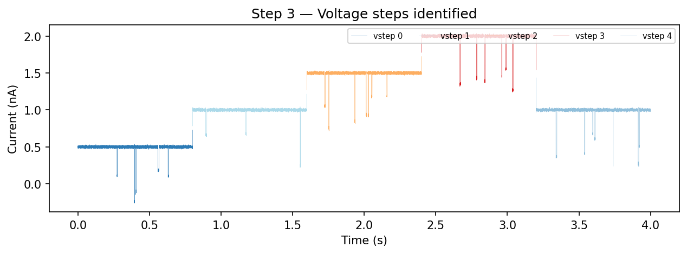
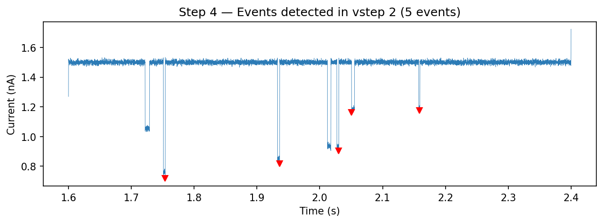
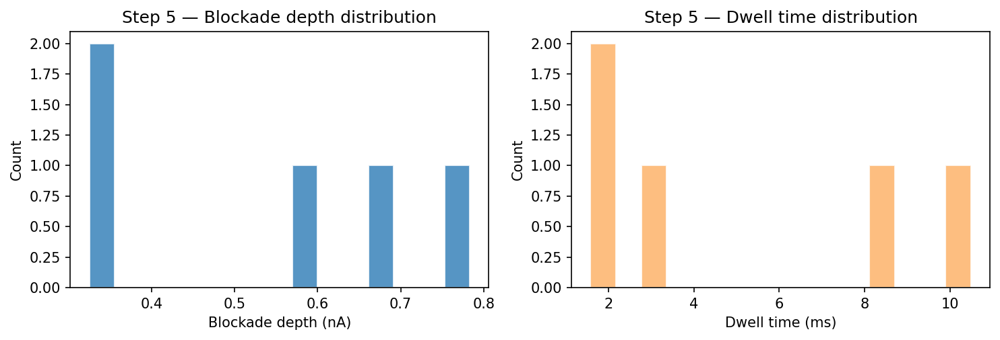
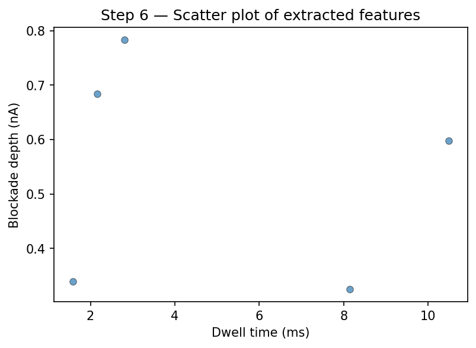

.. _tutorial:

Tutorial: End-to-End Nanopore Analysis
=======================================

This tutorial walks through a complete analysis pipeline: loading a nanopore
recording, preprocessing, event detection, and feature extraction. The code
uses ionique's API with synthetic data standing in for a real recording.

Step 1: Load the data
---------------------

Load an EDH file with voltage-step splitting enabled. The reader returns
metadata, current, and voltage arrays. Wrap them in a ``TraceFile``.

.. code-block:: python

   from ionique.io import EDHReader
   from ionique.datatypes import TraceFile

   reader = EDHReader("experiment.edh", voltage_compress=True, downsample=1)
   trace = TraceFile(*reader)

   print(f"Samples: {trace.n}")
   print(f"Sampling freq: {trace.sampling_freq} Hz")
   print(f"Duration: {trace.n / trace.sampling_freq:.1f} s")
   print(f"Voltage steps: {len(trace.children)}")

The trace now has children at rank ``"vstep"`` — one per constant-voltage
segment. Inspect them:

.. code-block:: python

   for i, vs in enumerate(trace.children):
       voltage = vs.get_feature("voltage")
       print(f"  vstep {i}: samples {vs.start}–{vs.end}, "
             f"V = {voltage*1000:.0f} mV, mean I = {vs.mean:.3f} nA")

Step 2: Filter noise
--------------------

Apply a 5 kHz lowpass Butterworth filter to remove high-frequency noise.
The filter modifies the current array in place.

.. code-block:: python

   from ionique.utils import Filter

   filt = Filter(
       cutoff_frequency=5000,
       filter_type="lowpass",
       filter_method="butter",
       order=2,
       bidirectional=True,
       sampling_frequency=trace.sampling_freq,
   )
   filt(trace.current)

Step 3: Trim voltage-step edges
-------------------------------

Remove the first 500 samples of each voltage step to discard capacitive
transients. This creates children at rank ``"vstepgap"`` under each
``"vstep"``.

.. code-block:: python

   from ionique.utils import Trimmer

   trimmer = Trimmer(samples_to_remove=500)
   trimmer(trace)

   print(trace.summary())
   # {'file': 1, 'vstep': 5, 'vstepgap': 5}

Step 4: Detect events
---------------------

Use ``AutoSquareParser`` to find blockade events within each trimmed voltage
step. This detects regions where current drops below a fraction of the
open-channel baseline.

.. code-block:: python

   from ionique.parsers import AutoSquareParser

   detector = AutoSquareParser(
       threshold_baseline=0.7,
       expected_conductance=1.9,
   )
   trace.parse(detector, newrank="event", at_child_rank="vstepgap")

   events = trace.traverse_to_rank("event")
   print(f"Total events detected: {len(events)}")

Inspect a few events:

.. code-block:: python

   for ev in events[:5]:
       print(f"  [{ev.start}:{ev.end}] n={ev.n}, "
             f"mean={ev.mean:.3f} nA, std={ev.std:.4f}")

If your events have multi-level current structure (e.g. a protein blocking
in stages), you can further segment sub-states within each event:

.. code-block:: python

   from ionique.parsers import SpeedyStatSplit

   splitter = SpeedyStatSplit(
       sampling_freq=trace.sampling_freq,
       min_width=50,
       window_width=10000,
   )
   trace.parse(splitter, newrank="state", at_child_rank="event")

Step 5: Extract features
-------------------------

Collect event statistics into a pandas DataFrame:

.. code-block:: python

   from ionique.utils import extract_features

   df = extract_features(
       trace,
       bottom_rank="event",
       extractions=["mean", "std", "min", "max", "duration", "n", "start", "end"],
       lambdas={
           "blockade_depth": lambda seg: seg.climb_to_rank("vstepgap").mean - seg.mean,
           "voltage_mV": lambda seg: seg.get_feature("voltage") * 1000
               if seg.get_feature("voltage") else None,
       },
   )

   print(df.head())
   print(f"\nTotal events: {len(df)}")
   print(f"Mean blockade depth: {df['blockade_depth'].mean():.3f} nA")
   print(f"Mean dwell time: {df['duration'].mean()*1000:.2f} ms")

Step 6: Visualize results
-------------------------

Plot the scatter of dwell time versus blockade depth:

.. code-block:: python

   import matplotlib.pyplot as plt

   fig, ax = plt.subplots(figsize=(6, 4))
   ax.scatter(
       df["duration"] * 1000,
       df["blockade_depth"],
       s=25, alpha=0.7, edgecolors="#333", linewidths=0.5,
   )
   ax.set_xlabel("Dwell time (ms)")
   ax.set_ylabel("Blockade depth (nA)")
   ax.set_title("Event scatter")
   plt.tight_layout()
   plt.show()

You can also use ``qp_trace()`` to see events overlaid on the trace:

.. code-block:: python

   from ionique.plotting import qp_trace

   qp_trace(
       trace,
       ranks=["vstepgap", "event"],
       downsamples={"vstepgap": 50, "event": 1},
       plot_voltage="split",
   )

Summary
-------

The complete pipeline:

.. code-block:: python

   from ionique.io import EDHReader
   from ionique.datatypes import TraceFile
   from ionique.parsers import AutoSquareParser, SpeedyStatSplit
   from ionique.utils import Filter, Trimmer, extract_features

   # Load
   trace = TraceFile(*EDHReader("experiment.edh", voltage_compress=True))

   # Preprocess
   Filter(cutoff_frequency=5000, filter_type="lowpass",
          sampling_frequency=trace.sampling_freq)(trace.current)
   Trimmer(samples_to_remove=500)(trace)

   # Detect events
   detector = AutoSquareParser(threshold_baseline=0.7, expected_conductance=1.9)
   trace.parse(detector, newrank="event", at_child_rank="vstepgap")

   # (Optional) Segment sub-states within events
   splitter = SpeedyStatSplit(sampling_freq=trace.sampling_freq, min_width=50)
   trace.parse(splitter, newrank="state", at_child_rank="event")

   # Extract features
   df = extract_features(trace, "event", ["mean", "std", "duration"])

**Next steps:**

- Try different parsers — see :doc:`parsers_guide`.
- Customize preprocessing — see :doc:`signal_preprocess`.
- Build IV curves — see :doc:`signal_analysis`.
- Explore events interactively — see :doc:`visualization`.
