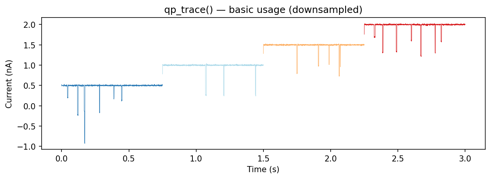
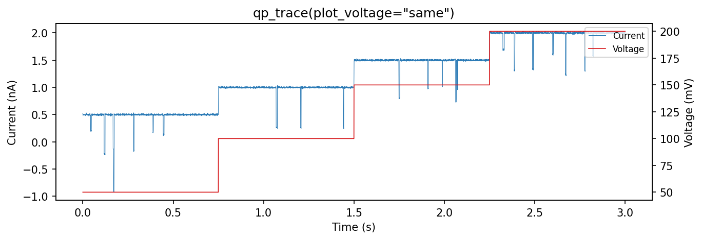
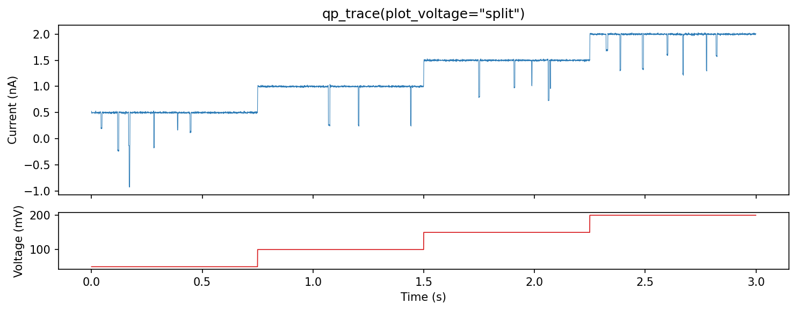

.. _visualization:

Visualization
=============

ionique provides ``qp_trace()`` for quick matplotlib-based trace plotting and
optional Panel/Bokeh dashboards for interactive exploration.

``qp_trace`` — quick plot
--------------------------

``qp_trace()`` plots a segment tree with different ranks colored and
downsampled independently:

.. code-block:: python

   from ionique.plotting import qp_trace

   qp_trace(trace)

This plots all ``"vstepgap"`` and ``"event"`` segments by default.

Parameters
^^^^^^^^^^

.. list-table::
   :header-rows: 1
   :widths: 22 28 50

   * - Parameter
     - Default
     - Description
   * - ``seg``
     - ``None``
     - Segment to plot. If ``None``, uses SessionFileManager root.
   * - ``ranks``
     - ``["vstepgap", "event"]``
     - List of ranks to display.
   * - ``downsamples``
     - ``{"vstepgap": 50, "event": 1}``
     - Per-rank downsampling factors. Higher values speed up rendering for
       long traces.
   * - ``fig_size``
     - ``(6, 5)``
     - Figure size in inches.
   * - ``ranks_kwargs``
     - ``{}``
     - Per-rank matplotlib kwargs for styling (colors, linewidths, etc.).
   * - ``fig_kwargs``
     - ``{}``
     - Additional kwargs passed to ``plt.subplots()``.
   * - ``plot_voltage``
     - ``None``
     - Voltage display mode: ``"same"``, ``"split"``, or ``None``.

Specifying ranks and downsampling
^^^^^^^^^^^^^^^^^^^^^^^^^^^^^^^^^

.. code-block:: python

   # Plot only events at full resolution
   qp_trace(trace, ranks=["event"], downsamples={"event": 1})

   # Plot vsteps heavily downsampled, events at full resolution
   qp_trace(
       trace,
       ranks=["vstep", "event"],
       downsamples={"vstep": 100, "event": 1},
   )

Voltage display
^^^^^^^^^^^^^^^

**plot_voltage="same"** — overlay voltage on the current axis with a twin y-axis:

.. code-block:: python

   qp_trace(trace, plot_voltage="same")

**plot_voltage="split"** — show voltage in a separate subplot below the
current:

.. code-block:: python

   qp_trace(trace, plot_voltage="split")

Styling with ``ranks_kwargs``
^^^^^^^^^^^^^^^^^^^^^^^^^^^^^

Pass matplotlib keyword arguments per rank:

.. code-block:: python

   qp_trace(
       trace,
       ranks=["vstepgap", "event"],
       ranks_kwargs={
           "vstepgap": {"color": "#cccccc", "linewidth": 0.3, "alpha": 0.5},
           "event": {"color": "red", "linewidth": 1.0},
       },
   )

Downsampling for performance
^^^^^^^^^^^^^^^^^^^^^^^^^^^^^

Long traces (>1M samples) can be slow to render. Use ``downsamples`` to plot
every Nth point:

.. code-block:: python

   # Plot vstep background at 1/100 resolution, events at 1/5
   qp_trace(
       trace,
       ranks=["vstepgap", "event"],
       downsamples={"vstepgap": 100, "event": 5},
   )

Interactive dashboards
----------------------

ionique includes a Panel/Bokeh dashboard for interactive event inspection.
This requires the ``panel`` extra:

.. code-block:: bash

   pip install ionique[panel]

.. code-block:: python

   from ionique.plotting import dashboard_event_inspection

   # df is a DataFrame from extract_features() with a "wrap" column
   dashboard = dashboard_event_inspection(df)
   dashboard.servable()

The dashboard displays a scatter plot of events and shows the current trace
for the selected event. It requires a ``"wrap"`` column containing the
context window around each event (produced by ``AutoSquareParser``).
